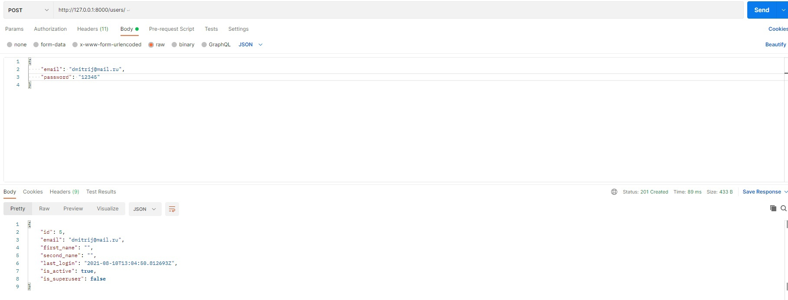
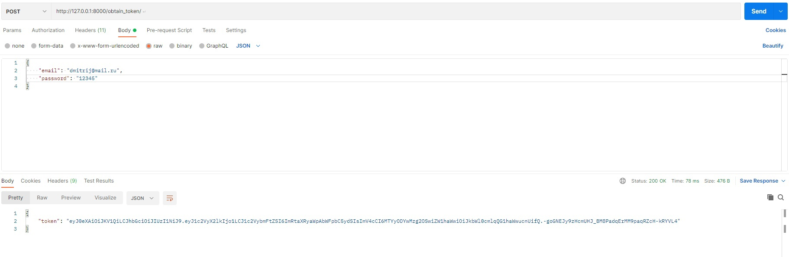
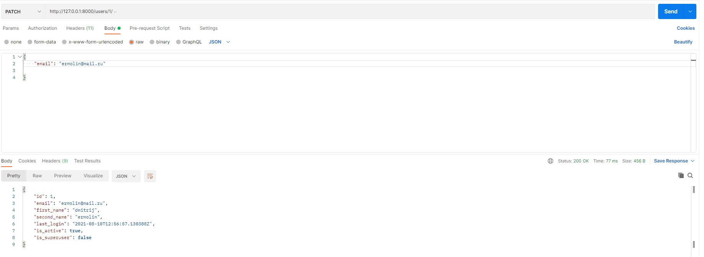
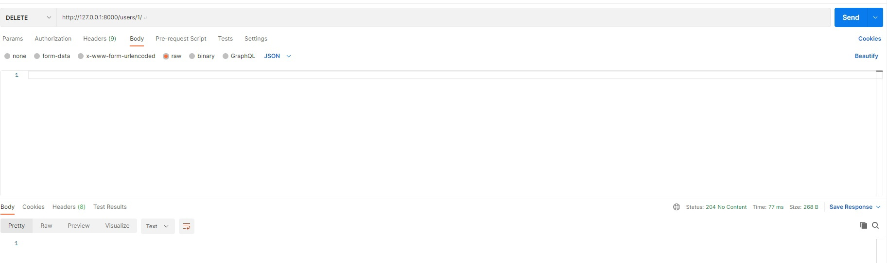

# Token-CRUD
This repo contains code to perform basic database operations (CRUD) for token-authenticated users

# Getting Started
[Install postgres](https://www.postgresql.org/)

Create your own database for project

Update pip and create virtual environment
```sh
$python3 -m venv /path/to/new/virtual/environment
```
Аfter creating virtual environment, run it
```sh
$source path/to/environment/bin/activate
```
Do some useful staff
```sh
$ git clone https://github.com/DmitriijErmolin/token-crud.git
$ cd token-crud/
$ pip install -r requirements.txt

```
Connect to your database and change settings in django_auth/settings.py
\
Make migrations for your database
```sh
$ python manage.py makemigrations
$ python manage.py migrate
```
Run server
```sh
$ python manage.py runserver
```
# Examples
To create a user, you need to go through the domain / users / and send the data using the POST method
\
After that, you need to obtain token for user (use post method on /obtain_token/)
\
Add headers to you methods:\
{"Content-Type": "application/json",\
"Authorization": "Bearer <b>your token</b>"}\
Finally you get access to methods such as READ, PUT, PATCH and DELETE\
Read:
\
PUT and PUTCH:
\
DELETE:
\
